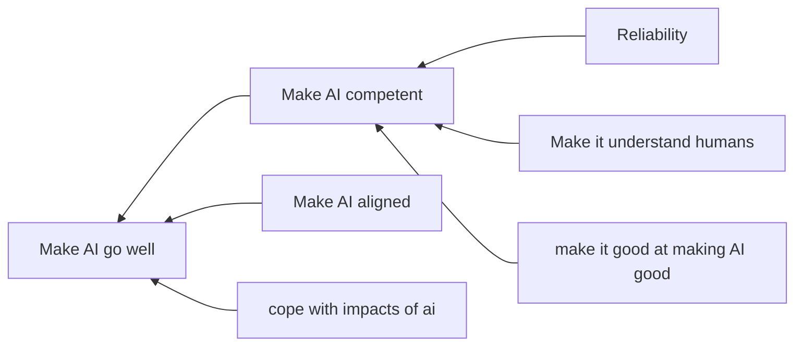
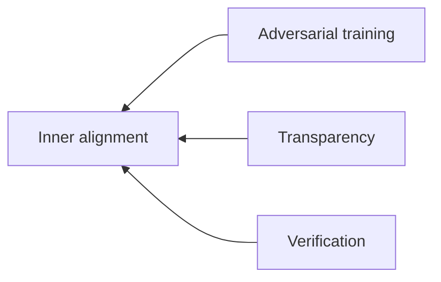
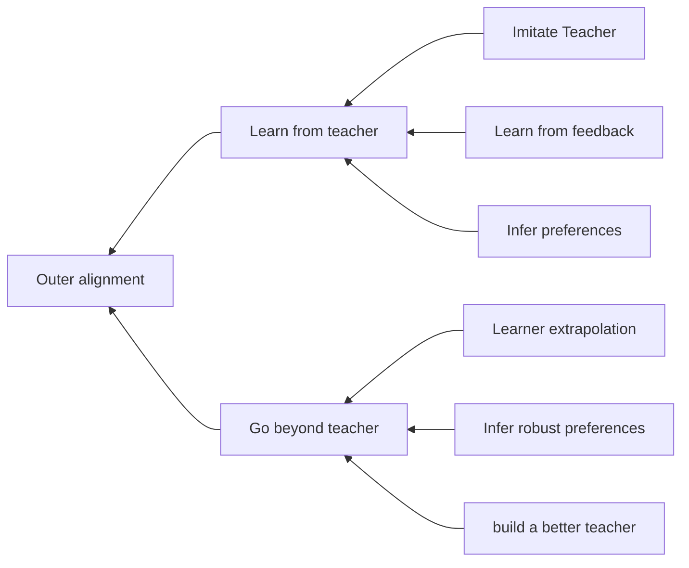

## Concepts referenced below
[[Inverse Reinforcement Learning (IRL)]]
[[Mechanistic interpretability]] - in reference to inner alignment's goal of transparency
[[Reinforcement Learning from human feedback (RLHF)]] - "learn from feedback" in outer alignment
[[Adversarial Training]]
[[Inner Alignment]]
[[Outer Alignment]]

Alignment tax: the cost of making systems that do what we want. Cost of insisting on alignment

[[Iterated Amplification]]: Using a team of AI systems as a teacher for a more capable model, and recursively improve

