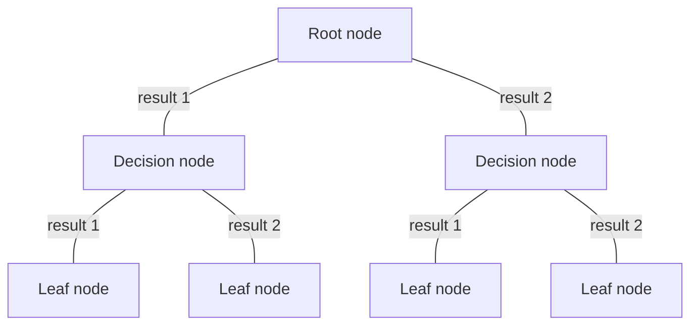

An ML model that follows discrete parameters to do a classification task

Takes the shape of a CS tree. 

For polynomial classification see [[One-hot encoding]].
The below is for discrete values. For continuous see [[Continuous values in decision trees]].
For regression problems see [[Regression trees]]
## Terminology
root node
decision nodes
leaf nodes

## Training Philosophy
Decision 1: 	How to choose what feature to split on at each node?
- Maximize purity (or minimize) (purity is also known as [[Entropy]])

Decision 2: When do you stop slitting?
- When a node is 100% one class
- When splitting a node will result in the tree exceeding a maximum depth
- When improvements in purity score are below a threshold
- When number of examples in a node is below a threshold

## Training Implementation
1. Start with all examples at the root node
2. Calculate the [[Information Gain]] for all possible features and pick the one with the highest value
3. Split the dataset according to the selected feature and create left and right branches
4. Keep splitting until the stopping criteria is met:
	- when a node has 0 entropy
	- when splitting a node would result in the tree exceeding a max depth
	- when info gain from additional splits is less than a threshold 
	- when the number of examples in a node is below a threshold

