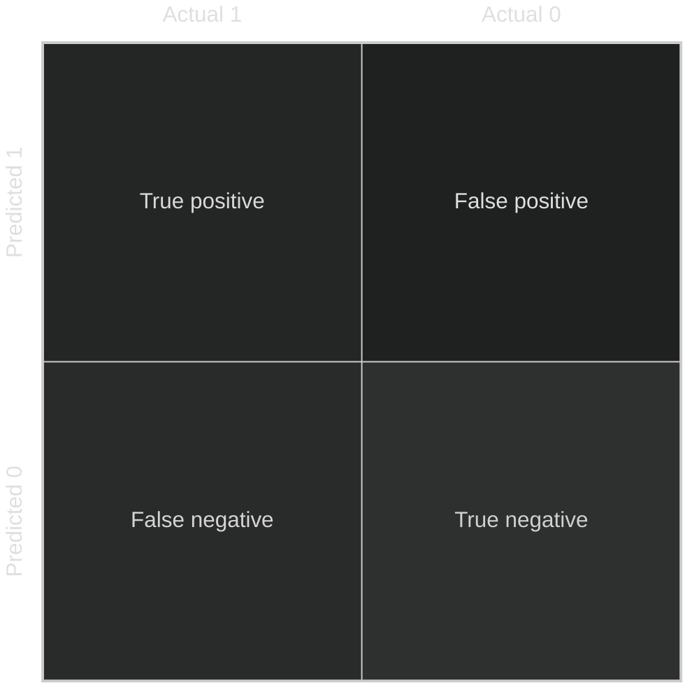

Precision: 
- of all patients where we predicted $y=1$, what fraction actually are true 1?
- true positive / predicted positive
$$
\frac{\text{true positive}}{\text{true positive} + \text{false positive}}
$$

Recall:
- of all cases that actually are $y=1$, what fraction did we correctly predict?
- true positive / actual positive
$$
\frac{\text{true positive}}{\text{true positive} + \text{false negative}}
$$

## Tradeoffs
It is usual that to improve precision, recall will suffer, and vice-versa

To increase precision in a logistic regression, increase the threshold of outputting 1

> predict 1 if $f_{w,b}(x) \geq 0.7$
> predict 0 if $f_{w,b}(x) \lt 0.7$
by increasing the threshold from 0.5, we miss some actual 1's as the cost for being more accurate in our prediction (precision)

higher threshold --> $\uparrow$ higher precision / $\downarrow$ lower recall
lower threshold --> $\downarrow$ lower precision / $\uparrow$ higher recall

## F1 score
To combine precision and recall metrics into one number, it is common to use the F1 score
$$
F1 = \frac{1}{\frac{1}{2}(\frac{1}{p} + \frac{1}{R})} = 2 \frac{PR}{P + R}
$$
> the inverse of the average of 1/P and 1/R

This emphasizes very small (bad) values