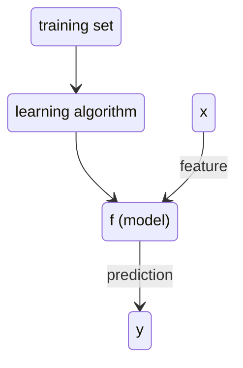

A [[Supervised learning]] algorithm whose goal is to predict numbers on a continuum

## [[Linear Regression]]

## Terminology
x - input variable aka "feature"
y - output variable aka "target" variable
m - number of training examples

input/output - features/targets

$\hat{y}$ - estimated y value aka "prediction"
y - actual value aka target

the model can be a number of algorithms including [[Linear Regression]]