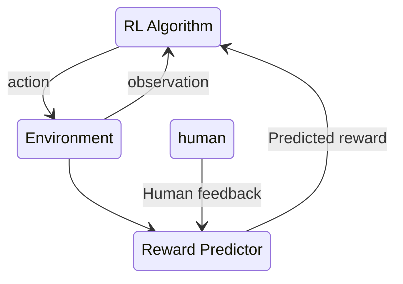

AI starts by acting randomly in an environment
After some time, a human is asked to A/B test two video clips to see which is moving in the direction of a desired goal

## For NLP / language models

Step 1. Language Model pretraining
Step 2. Reward Model Training
Step 3. Fine-tuning with RL 