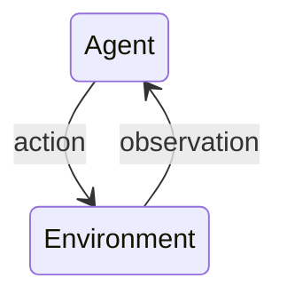
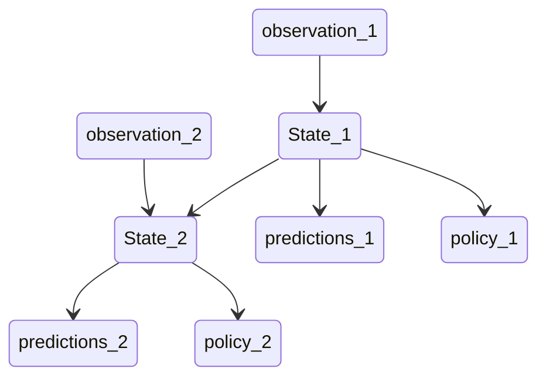

## Definition
> The Science and framework of **learning to make decisions** from **interaction**

If the goal is to learn via _interaction_, then this is a reinforcement learning problem

## 
The interaction loop 
> An agent exists within an environment. It takes actions on/within its environment and then makes observations of the repercussions

-[^1]
[^1]: made with [mermaid](https://mermaid.js.org/syntax/stateDiagram.html)

Reward hypothesis
> Any goal can be defined in some way by maximizing some cumulative reward

Rewards could be defined as 
- 0 before achieving some goal and 1 afterward
- $-1$ before achieving some goal and 0 afterward, implementing a penalty; the agent minimizing its cumulative penalties
- adding some temporal aspect by allowing time to be considered a penalty, incentivizing speed

## How it is different from other types of learning
- time - no supervised learning model has to handle time
- consequences of actions
- actively gathering experience
- predicting the future
- dealing with uncertainty 

## Notation

At each time step $t$ an agent:
- receives observation $O_t$ (and reward $R_t$)
- executes action $A_t$
The environment
- receives action $A_t$
- Emits observation $O_{t+1}$ (and reward $R_{t+1}$)

the reward is a scalar value

note: the time step increments after the user action

Accumulative reward otherwise known as the *return*
$G_t = R_{t+1} + R_{t+2} + R_{t+3} + ...$

**Value**
> the expected return
> depends on the actions the agent makes

The goal is to maximize value (by picking suitable actions)
**Utility** 
> rewards and values together define utility of states and actions (with no supervised feedback)

**Policy**
> a mapping from states to actions

$q(s,a) = \mathbb{E}[G_t|S_t = s, A_t = a]$
		  $= \mathbb{E}[R_{t+1} + R_{t+2} + R_{t+3} + ... | S_t = s, A_t = a]$

**Environment**
> dynamics of the problem

**Reward**
> signal (specifies the goal)

**Agent** (will/might have the following)
- state - internal state of the agent
- policy
- value function estimate ?- prediction of the value 
- model ?- prediction of the dynamics of the world 
[^2]
[^2]: the question mark means not required

## agent state
> the agent's history is used to construct the agent state

[[Full observability]]
> a situation where an agent can observe the full environment state (an uncommon situation)

The [[Markov decision process]] tells us that the state contains all we need to know from the history

Agent state $S_t$ is some compression of the history $H_t$

When referencing _state_, it is assumed to be the agent state, $S_t$

recursive update state function
$S_{t+1} = u(S_t, A_t, R_{t + 1}, O_{t + 1})$
where us is a state update function

### Examples of agent states
- getting last observation: $S_t = O_t$ (might not be enough)
- getting the complete history: $S_t = H_t$ (might be too large)
- a generic update: $S_t = u(S_{t-1},A_{t-1},R_t,O_t)$ (but how to pick/learn $u$?)

## Policy
**Policy**
> defines a model's behavior
> map from agent state to action
### Stochastic policy
$\pi(A|S) = p(A|S)$
$\pi$ - the probability of an action, given a state [^3]
[^3]: pi is often used to denote policy
## Value function
> the expected return 
> depends on a policy

**discount factor** $\gamma$ [0, 1]
> trades off importance of immediate vs long-term rewards

if 0, only care about near term reward
if 1, 'the undiscounted case' where all rewards are equally important, regardless of time. 

Can be used to measure the desirability of states
Can be used to select between actions
$G_t = R_{t+1} + \gamma \space G_{t+1}$

## Model
> predicts what the environment will do next
> "a model of the environment"

## Agent categories
- Value based
	- No policy (Implicit)
	- Value Function
- Policy based
	- Policy
	- No value function
- Actor critic
	- Policy 
	- Value Function

- Model Free
	- Policy and/or value function
	- no model
- Model based
	- Optionally policy and/or value function
	- model 

## Subproblems of the RL problem
- prediction - evaluate the future (for a given policy)
- control - optimizing the future (find the best policy)

### two fundamental problems
- learning 
	- the environment is initially known
	- the agent interacts with the environment
- planning
	- any computational process that helps you improve on your policies or predictions inside the model without looking at new experiences
	- aka. reasoning, pondering, search

