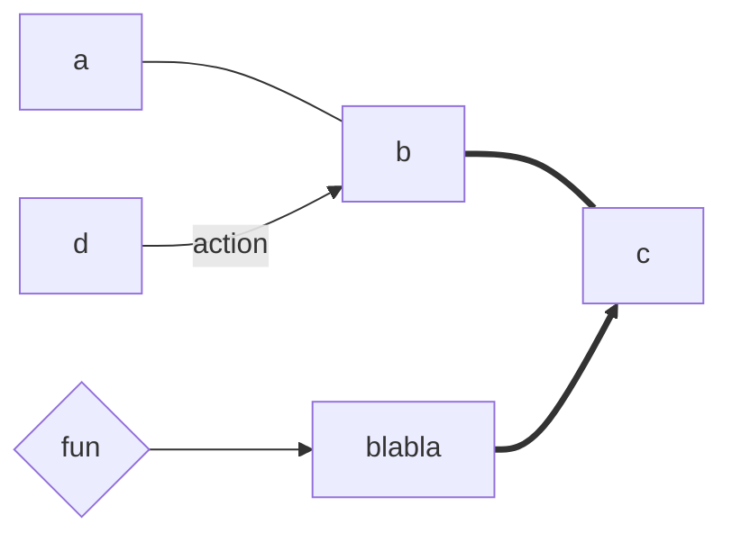
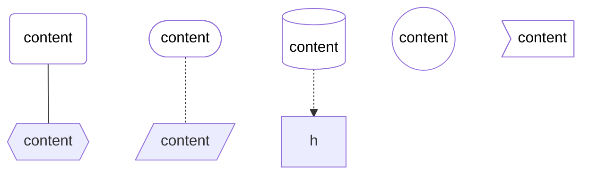
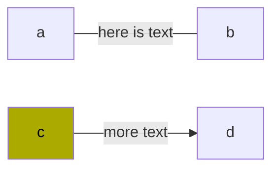
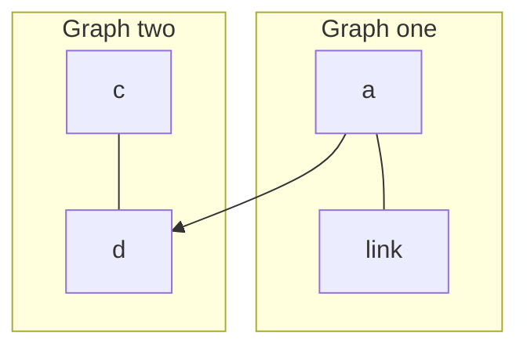
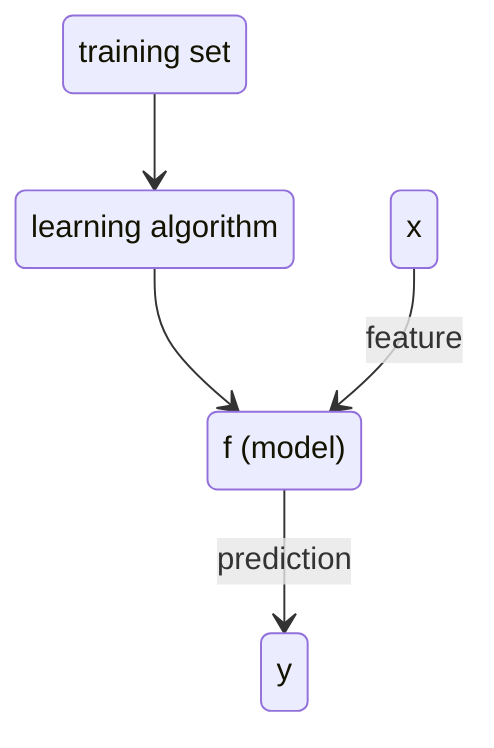
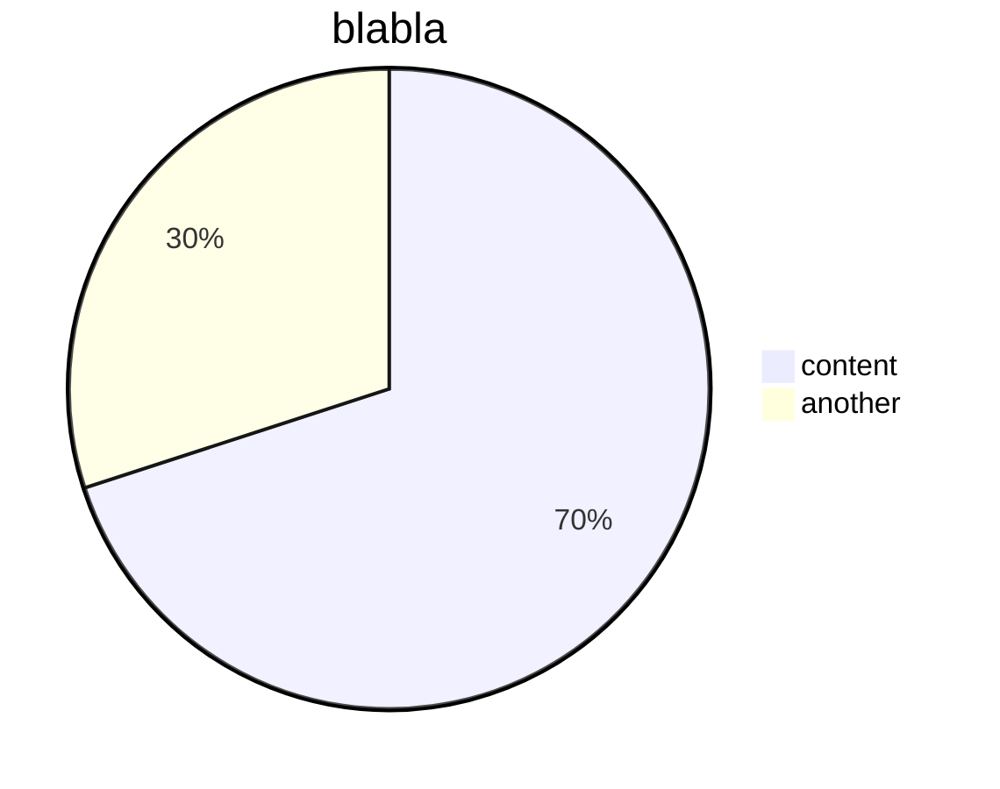
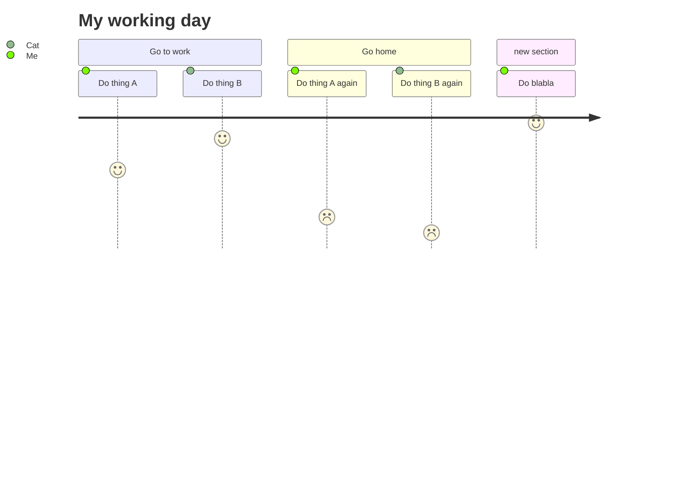

## Flow chart

### Orientation
- TD - top down (also TB for top to bottom)
- BT - bottom to top
- RL - right to left
- LR - left to right

### Misc 
thicker lines, use '=' over '-'
## State diagram

## Bar Chart

## Journey

